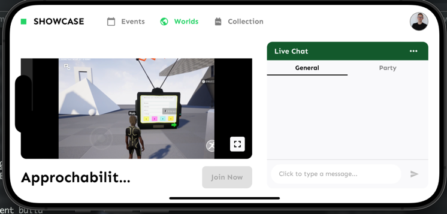

Repo for exploring GFN streaming via a mobile WebView.

## Current State
This project has been tested on iOS (Simulator and Native), Android (Simulator, Native) and Mac for development

Requires a monkey patch to GFN to stop it classifying the device as `unknown` which causes the
session to abort. This patch is injected when the WebView starts. The patch ensures the
request always returns a valid operating system.

## Running
Download a zip of this repository, and extract to a location of your choice.

Ensure you have the `Expo Go` app installed on your mobile device/your emulator. The project is currently configured for 
version 51.

After you have downloaded this project, navigate to this project's directory, and in your terminal, run:
`npm i` 

**For Native Devices**
- You should be able to find the `Expo Go` app in the relevant app store for your device. Simply download and install.

**For Emulators:** 
- Download an emulator (e.g. for Android, you can download the latest version of Android Studio, and spin up their default virtual device)
- Download Expo Go for emulators and drag onto your virtual device to install app on emulator

Once your emulator is up and running, in your project repo execute:
- `npx expo start`

If this command does not work on your native device (e.g. your android phone), execute a different command in your terminal from your project directory:
- `npx expo start --tunnel` - this will allow your device to connect to your development project.

This may require you to install an additional package:
`The package @expo/ngrok@^4.1.0 is required to use tunnels, would you like to install it globally?`

- Simply enter 'y' to accept and install.

You can now either scan the QR code, or copy and paste the relevant exp:// url from the logs into the expo app. This should load an example landing page, from which you can enter our example MSquared world.
